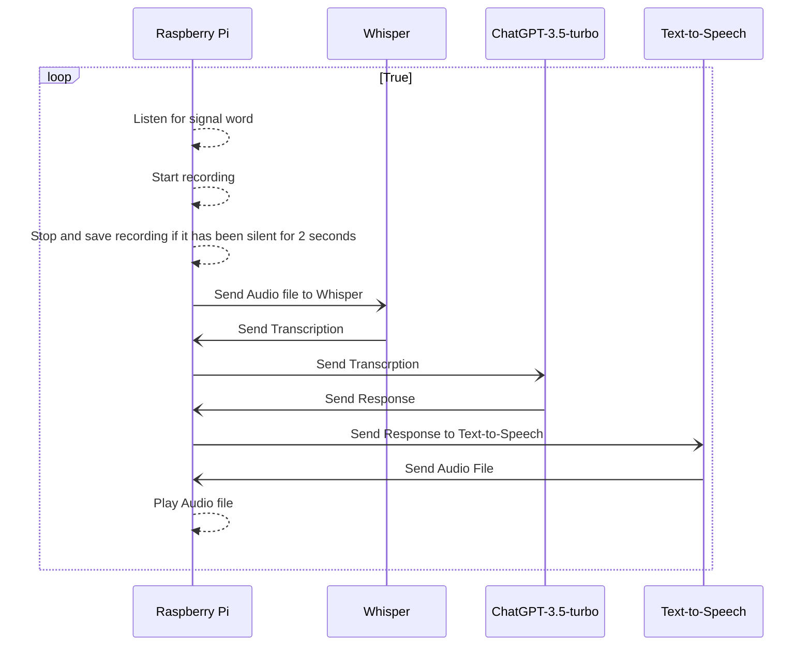

```mermaid
sequenceDiagram
    loop True
        Raspberry Pi-->> Raspberry Pi: Listen for signal word
        Raspberry Pi-->> Raspberry Pi: Start recording
        Raspberry Pi-->> Raspberry Pi: Stop and save recording if it has been silent for 2 seconds
        Raspberry Pi-)Whisper: Send Audio file to Whisper
        Whisper-)Raspberry Pi: Send Transcription
        Raspberry Pi-)ChatGPT-3.5-turbo: Send Transcrption
        ChatGPT-3.5-turbo-)Raspberry Pi: Send Response
        Raspberry Pi-)Text-to-Speech: Send Response to Text-to-Speech
        Text-to-Speech-)Raspberry Pi: Send Audio File
        Raspberry Pi-->> Raspberry Pi: Play Audio file
    end
```