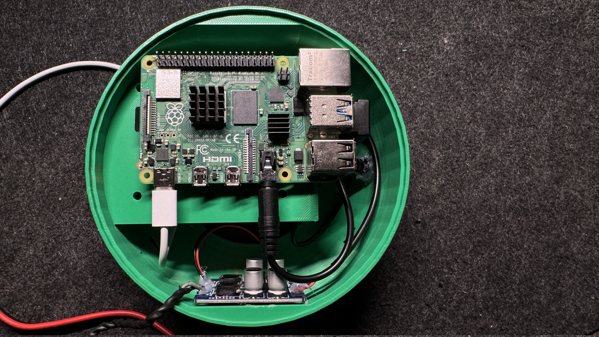
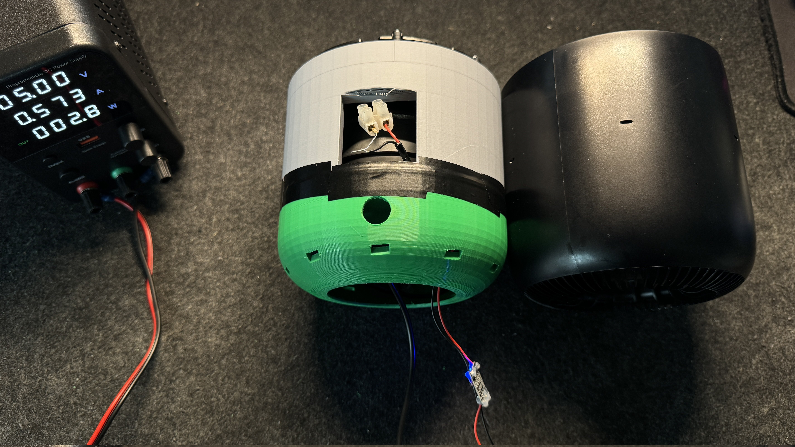
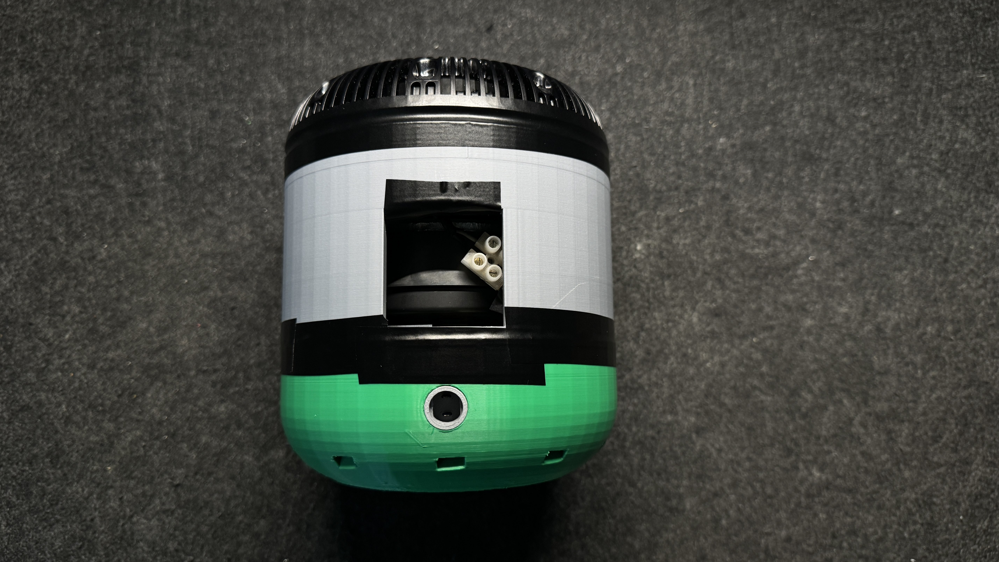
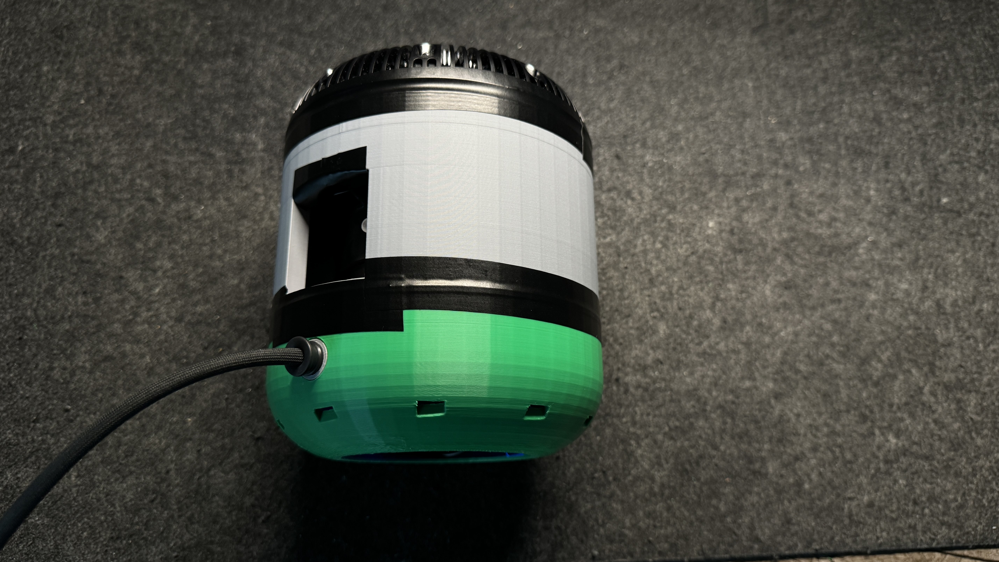

# Homepod

As I already mentioned, I wanted to refactor an old broken Apple Homepod 1.
But this wasn't as simple as just getting everything out of the homepod, putting my Rhaspberry Pi 4 inside and voilà - done. 
After some not so great solutions (stuffing everything inside and praying that nothing breaks) I decided to print my own enclosure.
This was at the same time my first 3D-modelling work.

## Base-Part

I designed and printed the base as follows.
The Rhaspberry Pi has its own place, as well as the amplifier.
There is enough space for the power supply and the Aux-cable.
The USB-A connection for the microphone is a corner connector and _bends_ the port to underneath the Rhaspberry pi and its ledge.

## Mid-Part

The mid-part only contains the original Homepod speaker which is connected to the amplifier.
I also added a resistor (300-something Ω) to reduce noise, but I would advise to use a resistor in the range of 50 to 150 Ω.
Thankfully, I added a small window which is meant to be used for ventilation as I could connect the speaker more easily (the cable is rather short). 

## Top-Part

I decided to use the top part, as it fitted and there was no need to re-invent a perfectly functional part.
Maybe I will add some lights to the top, but that would require me to re-invent the mid-part.
All in all, this looks quite good.

# Charging Port

I also made my own charging port to be able to use the Apple original charging cable.
The sleeved gray cable is quite good-looking and works best with the original design.
One issue to note:

The charging port should be 3-4mm deeper. 
The connector stands a bit out, but should not be an issue as it is behind the Homepod.
Most importantly, it connections firmly.

